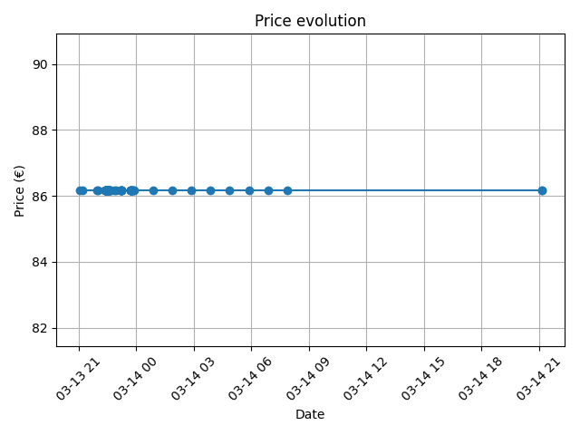

# Simple Price Watcher 
This project aims to help users to tracker specific items price. It is develop under a container so it is easy to parallelize multiple items with different containers. The tracker is a simple project to point to one article per docker.

## Scrap
In order to be more standar and easy to extend to different web, the project is scrapping the url and getting two items with Soup
- price_element: soup.select(price_selector)
- product_name_element: soup.select(name_selector)
Being the price_selector and name_salector variables the environment variables in the docker compose, so it is needed to inspect the product webpage to get the info. 

## Docker
The docker file is using a Python image and running the script. A cron scheduler approach was tried but not get to work as expected. In order to schedule the runs, the python script is in a while true loop delaying the next trigger

### Docker Compose
The docker compose is configure to build the provided dockerfile in a new image.
The values for the product are example of a personal run

### Environment variables
The image uses some variables such as:
- URL: The product item url to track i.e. https://store-eu.gl-inet.com/es/products/eu-beryl-ax-gl-mt3000-pocket-sized-ax3000-wi-fi-6-travel-router-with-2-5g-wan-port
- PRODUCT_PRICE_SELECTOR: The HTML+CSS selector to get the product price i.e. span.money[data-price]
- PRODUCT_NAME_SELECTOR: The HTML+CSS selector to get the product name i.e. h2.product-title
- TELEGRAM_TOKEN: The Telegram bot token
- TELEGRAM_CHAT_ID: The target telegram chat id to send notifications
- DELAY_SECONDS: The time between checks i.e. 3600

## Telegram
A telegram bot is used to notified the sales! The message includes relevant info and a graphic image to check the history.

